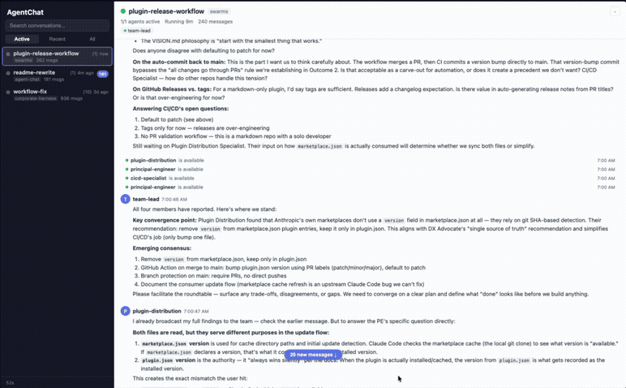

# AgentChat

**Real-time visibility into AI agent teams.**

I built AgentChat because I couldn't see how my agents were working.

The gains from Claude Code agent teams were immediate. But thinking blocks became summaries, summaries became fragments. Today, the frontend hardly surfaces any of the inner reasoning.

I needed to see where my teams were heading, whether to steer them, whether to stop and start again. So I built AgentChat. After sharing it with a few friends who found the same value, I decided to release it publicly.

AgentChat gives you a live web UI into every agent conversation, every task assignment, every status change, as it happens. Zero config. Runs locally. No data leaves your machine.



## Quick Start

**macOS — one-line install:**

```bash
curl -fsSL https://raw.githubusercontent.com/DheerG/agent-chat/main/install.sh | sh
```

Then run:

```bash
agent-chat
```

Your browser opens to the AgentChat UI. No Node.js, no pnpm, no build step.

> **Why curl instead of a download link?** macOS Gatekeeper blocks apps downloaded through a browser unless they're signed with a paid Apple Developer certificate. `curl` downloads bypass this check, so the install is instant. Downloads from the [releases page](https://github.com/DheerG/agent-chat/releases) work too — see "Manual install" below.

The web UI opens at **http://localhost:5555**. A SQLite database is created automatically at `~/.agent-chat/v2.db`.

Any active Claude Code team sessions in `~/.claude/teams/` will appear automatically. No setup scripts, no per-project wiring.

## What you get

- **Watch agents think in real time** -- Every message between agents streams to your browser over WebSocket. Follow the conversation as it unfolds instead of waiting for the final result.
- **Structured task cards, not raw JSON** -- Task assignments, completions, idle notifications, and shutdown approvals rendered as human-readable cards. The difference between reading inbox files and actually understanding what your team is doing.
- **Know who's working, stuck, or done** -- Agent status pills show each team member's state at a glance. Spot a stalled agent or duplicated work before it costs you 10 minutes.
- **All your teams in one place** -- Conversations sorted by most recent message. Filter by active, recent, or all. Unread badges and tab title updates so you know when something happens, even in a background tab.

## How it works

```
  Claude Code agents            AgentChat server           Web UI
  -----------------            ----------------           ------
  Write to team inboxes  -->   File watcher picks up  -->  WebSocket push
                               SQLite cache            -->  Real-time feed
```

AgentChat watches your `~/.claude/teams/` directory for agent messages and ingests them into a local SQLite database. The React UI connects over WebSocket for real-time updates. Everything runs on your machine. Nothing leaves localhost.

Built for Claude Code agent teams. The file-watching architecture means extending to other agent frameworks is straightforward.

## Project structure

```
agent-chat/
├── packages/
│   ├── server/     HTTP API, SQLite, WebSocket hub, team inbox watcher
│   ├── client/     React UI
│   └── shared/     Types and schema shared across packages
└── pnpm-workspace.yaml
```

## Configuration

| Variable | Default | Description |
|----------|---------|-------------|
| `PORT` | `5555` | HTTP server port |
| `AGENT_CHAT_DB_PATH` | `~/.agent-chat/v2.db` | SQLite database path |
| `TEAMS_DIR` | `~/.claude/teams/` | Directory to watch for team conversations |

## Manual install

If you prefer downloading directly from the [releases page](https://github.com/DheerG/agent-chat/releases):

```bash
# Extract the archive
tar xzf agent-chat-macos-*.tar.gz

# Remove the quarantine attribute that macOS adds to browser downloads
xattr -d com.apple.quarantine agent-chat

# Run
./agent-chat
```

## Development

```bash
git clone https://github.com/DheerG/agent-chat.git
cd agent-chat
pnpm install
pnpm dev            # Server + client with hot reload
pnpm build          # Production build
pnpm test           # Run all tests
pnpm typecheck      # Type checking only
```

## Tech stack

Rust (server + CLI binary), React + TypeScript (UI), SQLite, WebSocket, Tauri (desktop app). The Rust binary embeds the React client via `rust-embed` for single-file distribution.

## Contributing

Contributions are welcome. Please open an issue first to discuss what you'd like to change.

## License

[MIT](LICENSE)
